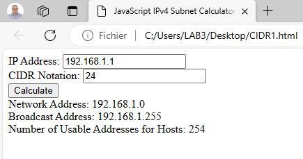

# JavaScript IPv4 Subnet Calculator with CIDR Notation

This is a simple web-based IPv4 subnet calculator that allows users to calculate the network address, broadcast address, and the number of usable addresses for hosts based on CIDR notation.

## Usage

1. Enter the IP address in the "IP Address" field.
2. Enter the CIDR notation (1-32) in the "CIDR Notation" field.
3. Click the "Calculate" button to perform the subnet calculation.
4. View the calculated results for the network address, broadcast address, and the number of usable addresses for hosts.

## Example

For example, if you enter:
- IP Address: 192.168.1.1
- CIDR Notation: 24

The program will output:
- Network Address: 192.168.1.0
- Broadcast Address: 192.168.1.255
- Number of Usable Addresses for Hosts: 254

## How It Works

The JavaScript code behind this calculator takes user input, validates the CIDR notation, and performs subnet calculations to determine the network address, broadcast address, and the number of usable addresses for hosts.

## Author

- **Author:** Larbi OUIYZME
- **Version:** 1.0

## License

This project is licensed under the [MIT License](LICENSE.md). See the [LICENSE](LICENSE) file for details.

Feel free to use and modify this calculator to suit your needs. If you encounter any issues or have suggestions for improvement, please let me know.

  

Happy subnetting!
